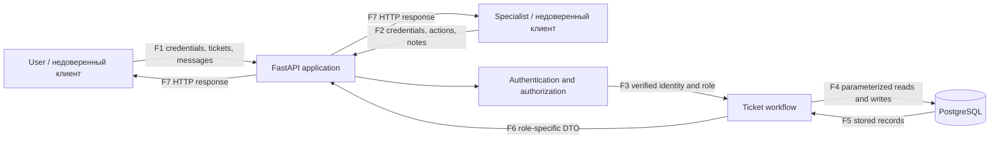

# Модель угроз Campus Helpdesk

## 1. Область и состояние модели

Модель относится к небольшому Web API Campus Helpdesk, описанному в
[PROJECT.md](../PROJECT.md). Минимальная техническая основа реализована; перед
EK1 модель необходимо повторно сверить с оцениваемой версией.

В области модели находятся аутентификация, обращения, публичные сообщения,
внутренние заметки, назначение специалиста, состояния и журнал значимых
изменений. Frontend, вложения, email и внешние интеграции исключены.

## 2. Архитектура и потоки данных

### Компоненты

| Компонент | Назначение | Состояние к моменту подготовки |
| --- | --- | --- |
| HTTP-клиент | Отправляет недоверенный ввод и получает ответы | Swagger/`curl`, планируется |
| FastAPI | Точка входа, валидация и маршрутизация | Реализовано в `app/main.py` |
| Аутентификация и авторизация | JWT, роль и отношение к объекту | Реализовано в `app/security.py`, `app/dependencies.py`, `app/main.py` |
| Предметный слой | Переходы состояния и рабочие операции | Реализовано в `app/main.py` |
| SQLite/PostgreSQL | Постоянное хранение через SQLAlchemy | SQLite проверена; PostgreSQL настроена в `compose.yaml`, но ещё не проверена |

### Границы доверия

**TB-1 — клиент/API.** Любые значения HTTP-запроса, включая идентификаторы,
роль, состояние и текст, считаются недоверенными. API обязан заново установить
идентичность и проверить право на конкретный объект и действие.

**TB-2 — приложение/хранилище.** База доступна только приложению и оператору
локального окружения. Приложение ограничивает запросы параметризованным слоем
доступа и не раскрывает клиенту внутренние ошибки БД.

## 3. Активы и последствия нарушения

| Актив | Конфиденциальность | Целостность | Доступность |
| --- | --- | --- | --- |
| Обращения и публичная переписка | Чужой пользователь не должен видеть содержимое | Подмена меняет смысл запроса и решения | Недоступность мешает получить помощь |
| Внутренние заметки | Доступны только специалистам | Подмена искажает диагностику | Потеря уничтожает служебный контекст |
| Роль и идентичность | Токены и парольные данные защищены | Подмена даёт чужие полномочия | Сбой блокирует законный доступ |
| Назначение и состояние | Ограниченно раскрываются участникам процесса | Подмена нарушает рабочий процесс | Зависшее состояние оставляет обращение без обработки |
| Журнал изменений | Метаданные доступны ограниченно | Подмена скрывает автора действия | Потеря мешает расследованию и проверке |

## 4. Допущения

- используются только учебные аккаунты и вымышленные данные;
- приложение запускается локально, транспортное шифрование за пределами
  локального стенда не моделируется как собственная функция приложения;
- создание аккаунтов выполняется учебным способом вне публичного API;
- администратор БД и оператор локального компьютера находятся за пределами
  прикладной модели нарушителя;
- секреты не должны попадать в Git, но фактическая проверка этого утверждения
  выполняется после появления конфигурации;
- защита от распределённого отказа в обслуживании инфраструктурного уровня не
  входит в небольшое ядро, но ограничения размера входа остаются в области API.

## 5. Нарушители

- аутентифицированный `User`, пытающийся получить данные другого пользователя
  или полномочия специалиста;
- аутентифицированный `Specialist`, выходящий за пределы назначенных рабочих
  операций;
- неаутентифицированный клиент с сетевым доступом к API;
- клиент, получивший украденный или подделанный токен.

## T-01 — Доступ к чужому обращению по идентификатору

- **Цель:** обращение и публичная переписка другого пользователя.
- **Предпосылки:** нарушитель аутентифицирован как `User` и узнаёт или подбирает
  идентификатор чужого обращения.
- **Сценарий:** нарушитель обращается напрямую к endpoint чтения, сообщения или
  повторного открытия, минуя список собственных обращений.
- **Последствия:** раскрытие переписки либо изменение чужого обращения.
- **Приоритет:** **высокий, входит в приоритетный набор** — идентификаторы доступны
  на клиентской стороне, а ущерб затрагивает конфиденциальность и целостность.
- **Связи:** [SR-02](SECURITY_REQUIREMENTS.md#sr-02) →
  [D-01](SECURITY_DECISIONS.md#d-01) → негативные объектные тесты.

## T-02 — Раскрытие внутренней заметки пользователю

- **Цель:** текст и метаданные внутренних заметок.
- **Предпосылки:** у пользователя есть законный доступ к своему обращению.
- **Сценарий:** общий сериализатор обращения или прямой endpoint заметки включает
  служебные поля в ответ пользователю.
- **Последствия:** раскрытие служебной оценки и деталей диагностики.
- **Приоритет:** **высокий, входит в приоритетный набор** — опасность возникает
  даже без обхода доступа к самому обращению и вероятна при повторном
  использовании одной модели ответа.
- **Связи:** [SR-03](SECURITY_REQUIREMENTS.md#sr-03) →
  [D-01](SECURITY_DECISIONS.md#d-01) → сравнение пользовательского и служебного
  представлений плюс прямой негативный запрос.

## T-03 — Незаконное назначение или изменение состояния

- **Цель:** ответственный специалист, состояние и решение обращения.
- **Предпосылки:** нарушитель может отправлять произвольные HTTP-запросы.
- **Сценарий:** клиент задаёт `assignee_id` или `status` напрямую, закрывает чужое
  обращение либо пропускает обязательный переход.
- **Последствия:** обращение остаётся без обработки или помечается решённым без
  законного основания.
- **Приоритет:** **высокий, входит в приоритетный набор** — изменение напрямую
  нарушает основной рабочий процесс.
- **Связи:** [SR-04](SECURITY_REQUIREMENTS.md#sr-04),
  [SR-05](SECURITY_REQUIREMENTS.md#sr-05) →
  [D-02](SECURITY_DECISIONS.md#d-02) → негативные тесты матрицы переходов.

## T-04 — Подмена идентичности или роли

- **Цель:** учётная запись и полномочия.
- **Предпосылки:** клиент может передавать поля идентичности либо изменять токен.
- **Сценарий:** нарушитель подставляет чужой `user_id`, заявляет роль
  `Specialist` или использует токен с неверной подписью/истёкшим сроком.
- **Последствия:** действия от чужого имени, доступ к очереди и внутренним
  заметкам.
- **Приоритет:** **высокий, входит в приоритетный набор** — успешная эксплуатация
  разрушает основу всех последующих проверок полномочий.
- **Связи:** [SR-01](SECURITY_REQUIREMENTS.md#sr-01),
  [SR-08](SECURITY_REQUIREMENTS.md#sr-08) →
  [D-03](SECURITY_DECISIONS.md#d-03) → проверки подписи, срока и серверного
  определения автора.

## T-05 — Некорректный или чрезмерный ввод

- **Цель:** целостность данных и доступность API.
- **Сценарий:** клиент отправляет неверные типы, очень длинные строки или строки
  с управляющими конструкциями в поля обращения и сообщений.
- **Последствия:** частичные записи, ошибки сервера, избыточное потребление
  ресурсов или инъекция при небезопасном доступе к БД.
- **Приоритет:** средний — ввод доступен всем пользователям, но небольшой учебный
  стенд и ORM уменьшают часть последствий.
- **Связь:** [SR-06](SECURITY_REQUIREMENTS.md#sr-06) → граничные и негативные тесты
  схем запросов.

## T-06 — Сокрытие происхождения значимого изменения

- **Цель:** журнал изменения состояния и назначения.
- **Сценарий:** участник задаёт чужого автора записи либо обычный endpoint
  изменяет/удаляет журнал.
- **Последствия:** невозможно установить, кто закрыл или повторно открыл
  обращение.
- **Приоритет:** средний — не всегда меняет само обращение, но затрудняет разбор
  инцидента и подтверждение результата.
- **Связь:** [SR-07](SECURITY_REQUIREMENTS.md#sr-07) →
  [D-02](SECURITY_DECISIONS.md#d-02) → проверка атомарного создания записи
  аудита.

## T-07 — Раскрытие пароля, токена или секрета подписи

- **Цель:** парольные данные, токены и конфигурационные секреты.
- **Сценарий:** секрет попадает в БД в открытом виде, журнал, ответ API или Git.
- **Последствия:** захват аккаунта или выпуск поддельных токенов.
- **Приоритет:** средний до проверки реализации; повысить до высокого, если
  фактическая конфигурация содержит секреты в репозитории или подробные логи.
- **Связи:** [SR-01](SECURITY_REQUIREMENTS.md#sr-01),
  [SR-08](SECURITY_REQUIREMENTS.md#sr-08) →
  [D-03](SECURITY_DECISIONS.md#d-03).

## T-08 — Гонка при принятии обращения

- **Цель:** единственность ответственного и согласованность состояния.
- **Сценарий:** два специалиста одновременно принимают одно обращение и
  перезаписывают решения друг друга.
- **Последствия:** неоднозначный ответственный и потеря обновления.
- **Приоритет:** средний — требует конкурентных запросов, но влияет на основной
  процесс.
- **Связи:** [SR-04](SECURITY_REQUIREMENTS.md#sr-04),
  [SR-05](SECURITY_REQUIREMENTS.md#sr-05) →
  [D-02](SECURITY_DECISIONS.md#d-02).

## T-09 — Раскрытие данных через ошибки и журналы

- **Цель:** содержимое обращений, заметки и внутреннее устройство приложения.
- **Сценарий:** необработанное исключение или избыточное журналирование возвращает
  клиенту текст запроса, SQL, стек или секретные поля.
- **Последствия:** дополнительное раскрытие данных и помощь дальнейшим атакам.
- **Приоритет:** низкий/средний — зависит от фактической конфигурации режима
  отладки и журналирования.
- **Связи:** [SR-03](SECURITY_REQUIREMENTS.md#sr-03),
  [SR-08](SECURITY_REQUIREMENTS.md#sr-08); проверка — запросы с ошибочным ID,
  просмотр стандартного HTTP-ответа и анализ журналов на отсутствие секретных
  полей.

## 6. Приоритетный набор

Для EK1 выбран набор `T-01`, `T-02`, `T-03`, `T-04`. Он покрывает четыре
основных риска продукта: объектный доступ, конфиденциальность служебных данных,
целостность рабочего процесса и достоверность идентичности. Для каждой угрозы
прослеживается цепочка до требования, решения и будущей проверки.

## 7. Пограничный случай для проверки согласованности

**Первоначально правдоподобное предположение:** проверки роли `Specialist` на
маршруте внутренних заметок достаточно.

**Контрпример:** пользователь законно запрашивает собственное обращение через
общий endpoint. Если одна ORM-модель сериализуется вместе со связью
`internal_notes`, заметки попадут в ответ без обращения к защищённому маршруту.

**Следствие:** `T-02` нельзя закрыть только проверкой роли при создании заметки.
`SR-03` требует также отдельного пользовательского представления ответа, а
`D-01` включает явное разделение публичного и служебного DTO. Будущая проверка
сравнивает ответы для двух ролей и проверяет отсутствие не только текста, но и
метаданных заметок.

`TODO перед защитой:` команда должна проверить этот анализ на фактической модели
ответов и сохранить только применимые утверждения.
